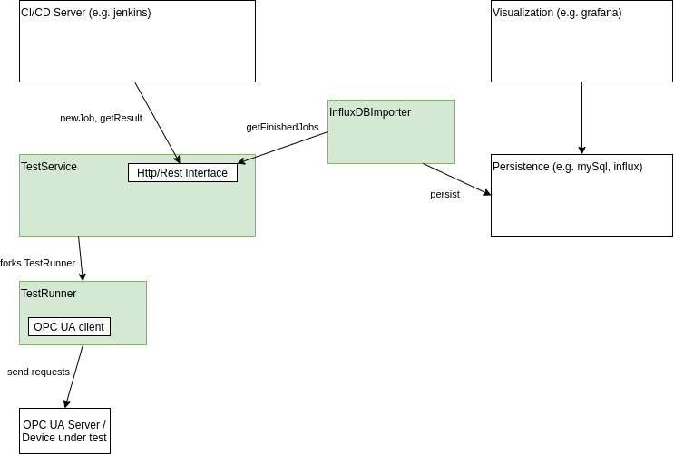

opcuaTestTool

## Overview

The main goal of this project is to automate OPC UA server performance testing. The intention is not to provide a unit test framework for OPC UA.

## Architecture

Components in green are covered by this project. A http client can trigger new jobs, retrieve results. After requesting a new job, the TestService forks and executes the TestRunner. The TestRunner is a single threaded application, which parses the job configuration, connects to the OPC UA Server and executes the requests. After finishing the tests, a result file with json content is written. 

On startup the testService will fetch the availabe test scripts from a github repo.



## Jobs

A job represents a single test run and execute a performance test script. The end user can implement performance test scripts with chaiscript.

The following opc ua specific types / method calls are exposed to the chai script interpreter:

* Variant read(NodeId id): reads the value attribute of a node
* void write(NodeId, Variant value): writes to the value attribute of a node
* vector<BrowseResult> browse(NodeId id): browses the hierachical references of the given id
* vector<Variant> call(NodeId objectId, NodeId methodId, vector<Variant> inputArguments)
* wait: pauses the job execution for N milliseconds


Todo - NOT IMPLEMENTED:
* readAttribute??
* subscribeToValueChanges
* subscribeToEvents

Per default all opc ua operations will check the statuscodes and throw an exception on error. The exception will not be catched by default, so the job will be marked as aborted.

## REST interface

### Triggering a new job
```bash
curl -H "Content-Type: application/json" --data @tests/rest/newJob.json http://localhost:9080/jobs
```
The test service assigns a unique id to the new job (ids are ordered), this id can be used to address the job in further requests.

### Get finished jobs
getting jobs starting at a certain id, max 100
```bash
curl http://localhost:9080/jobs?from=id&max=100
```

### Get results of job with id 0
```bash
curl http://localhost:9080/jobs/0
```

## Integration with InfluxDB and Grafana

Start influxDB
sudo docker run -p 8086:8086       -v $PWD:/var/lib/influxdb       influxdb

Start Grafana
sudo docker run -d --name=grafana -p 3000:3000 grafana/grafana


